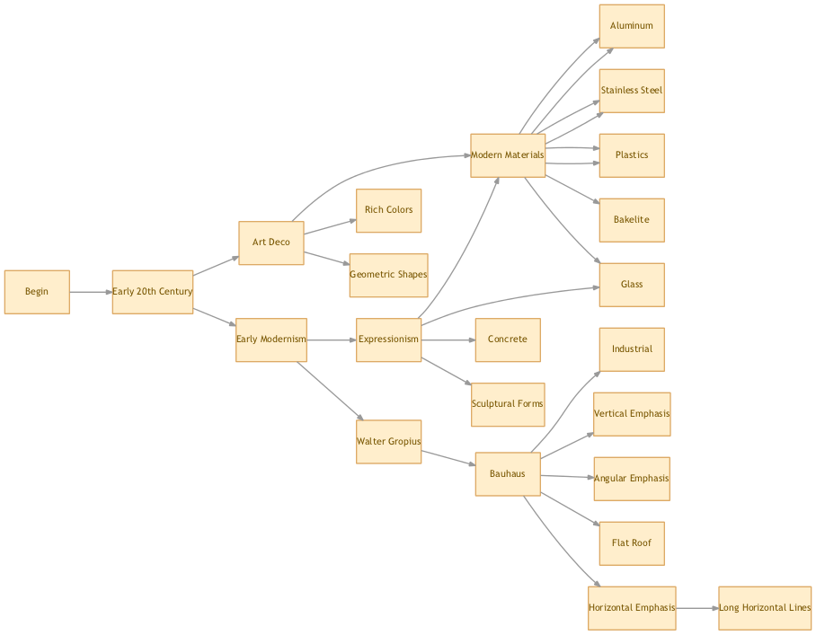

architech
=========

Idea I had for generating rulesets for procedurally generating architecture. The idea is to have a library of architectural styles that are made up of other architectural styles. At the lowest level, the idea is to have concrete methods for generating architecture.

The current version generates a graph that looks like this:

The more valuable part of this project is the architecture.json file.
